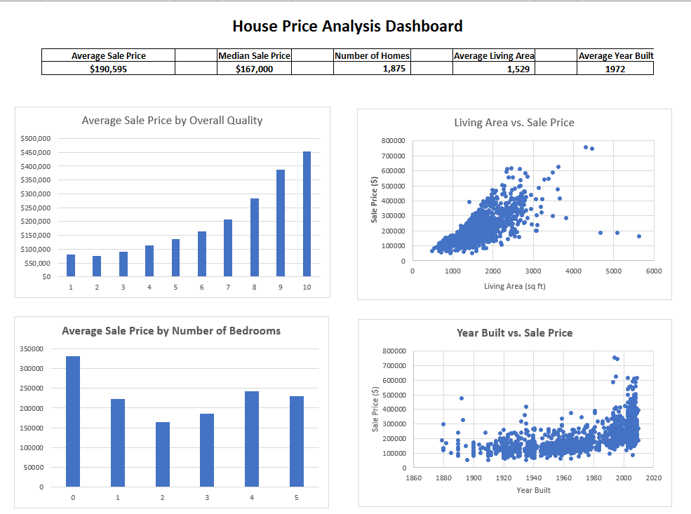

# House Price Analysis Dashboard

## Project Overview
This Excel project analyzes housing data to understand how property characteristics relate to sale prices. An interactive-style dashboard was created using KPIs, PivotTables, and data visualizations to summarize the dataset and highlight important housing market patterns.

## Tools Used
- Microsoft Excel
- PivotTables
- PivotCharts
- Scatterplots
- Excel formulas
- KPI reporting
- Data visualization

## Key Performance Indicators
- Average Sale Price: $190,595
- Median Sale Price: $167,000
- Number of Homes: 1,875
- Average Living Area: 1,529 sq ft
- Average Year Built: 1972

## Analysis
The dashboard examines:
- Average sale price by overall quality
- Living area compared with sale price
- Average sale price by number of bedrooms
- Year built compared with sale price

## Key Findings
- Homes with higher overall quality generally had substantially higher average sale prices.
- Larger living areas were generally associated with higher sale prices, although some observations differed from the overall pattern.
- The number of bedrooms alone did not show a consistent increase in average sale price.
- Newer homes generally showed higher sale prices, although sale prices varied considerably within individual construction periods.
- The average sale price was higher than the median sale price, indicating that higher-priced properties may be pulling the average upward.

## Business Value
This dashboard demonstrates how housing data can be transformed into information that supports market analysis and decision-making. Property characteristics such as overall quality, living area, bedrooms, and year built can be evaluated alongside sale price to identify patterns that may be useful for pricing, market research, and property analysis.

## Repository Files
- Excel workbook — Contains the source analysis, KPIs, PivotTables, and dashboard.
- Dashboard image — Provides a quick visual preview of the completed dashboard.
- `README.md` — Documents the project, analysis, and findings.

## Skills Demonstrated
- Excel data analysis
- KPI development
- PivotTable analysis
- Dashboard development
- Data visualization
- Business insight interpretation
## Dashboard Preview

